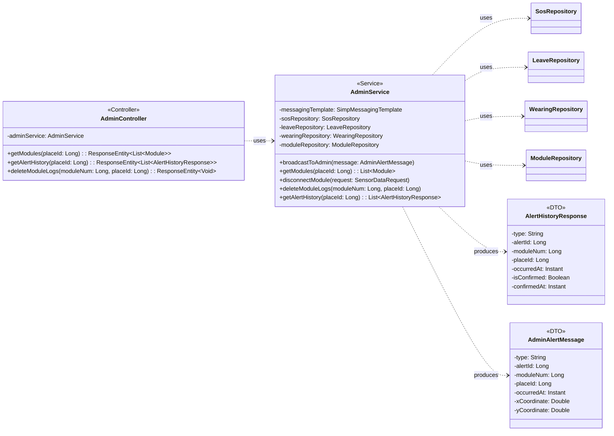

## Admin Class Diagram

 

## AdminService 클래스 정보

| 구분 | Name | Type | Visibility | Description |
|---|---|---|---|---|
| **class** | **AdminService** | | | 시스템 전반의 관리 및 알림 브로드캐스트를 담당하는 서비스 |
| **Attributes** | messagingTemplate | SimpMessagingTemplate | private | WebSocket 알림 전송을 위한 템플릿 |
| | sosRepository | SosRepository | private | SOS 이력 조회를 위한 레포지토리 |
| | leaveRepository | LeaveRepository | private | 이탈 이력 조회를 위한 레포지토리 |
| | wearingRepository | WearingRepository | private | 미착용 이력 조회를 위한 레포지토리 |
| | moduleRepository | ModuleRepository | private | 모듈 정보 조회를 위한 레포지토리 |
| **Operations** | broadcastToAdmin | void | public | 관리자 웹 클라이언트로 실시간 알림 전송 |
| | getModules | List~Module~ | public | 특정 장소에 등록된 모듈 목록 조회 |
| | disconnectModule | void | public | 모듈의 연결 종료/리셋 알림 처리 |
| | deleteModuleLogs | void | public | 특정 모듈의 모든 발생 이벤트(SOS, 이탈, 미착용) 로그 삭제 |
| | getAlertHistory | List~AlertHistoryResponse~ | public | 특정 장소의 모든 알림 이력을 통합하여 시간순 조회 |

 

## AlertHistoryResponse 클래스 정보 (DTO)

| 구분 | Name | Type | Visibility | Description |
|---|---|---|---|---|
| **class** | **AlertHistoryResponse** | | | 알림 이력 조회를 위한 응답 DTO |
| **Attributes** | type | String | private | 알림 타입 (SOS, LEAVE, WEARING) |
| | alertId | Long | private | 알림 고유 ID |
| | moduleNum | Long | private | 발생 모듈 번호 |
| | placeId | Long | private | 발생 장소 ID |
| | occurredAt | Instant | private | 발생 일시 |
| | isConfirmed | Boolean | private | 확인 여부 (SOS 전용) |
| | confirmedAt | Instant | private | 확인 일시 (SOS 전용) |

 

## AdminAlertMessage 클래스 정보 (DTO)

| 구분 | Name | Type | Visibility | Description |
|---|---|---|---|---|
| **class** | **AdminAlertMessage** | | | 관리자 화면용 실시간 알림 메시지 DTO |
| **Attributes** | type | String | private | 알림 타입 (SOS, LEAVE, WEARING, RESET 등) |
| | alertId | Long | private | 알림 ID |
| | moduleNum | Long | private | 모듈 번호 |
| | placeId | Long | private | 장소 ID |
| | occurredAt | Instant | private | 발생 시각 |
| | xCoordinate | Double | private | 발생 X 좌표 (실제 필드명) |
| | yCoordinate | Double | private | 발생 Y 좌표 (실제 필드명) |

