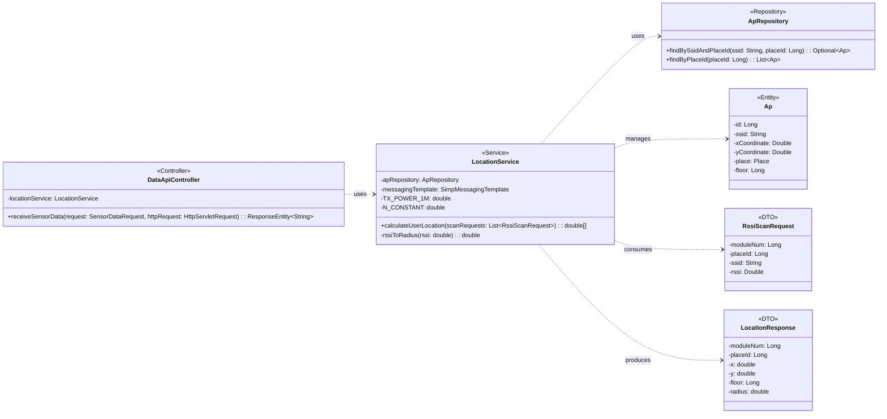

## AP & Location Class Diagram

 

## LocationService 클래스 정보

| 구분 | Name | Type | Visibility | Description |
|---|---|---|---|---|
| **class** | **LocationService** | | | WiFi RSSI 신호를 기반으로 사용자의 실시간 위치를 계산하는 서비스 |
| **Attributes** | apRepository | ApRepository | private | 등록된 AP 좌표 조회를 위한 레포지토리 |
| | messagingTemplate | SimpMessagingTemplate | private | 위치 정보를 실시간으로 클라이언트에 전송하기 위한 템플릿 |
| | TX_POWER_1M | double | static | 1m 거리에서의 기준 RSSI 값 (-45.0) |
| | N_CONSTANT | double | static | 경로 손실 지수 (3.2) |
| **Operations** | calculateUserLocation | double[] | public | 가장 강한 신호의 AP 좌표를 기준으로 사용자 위치를 결정하고 실시간 전송 |
| | rssiToRadius | double | private | RSSI 강도에 따른 오차 범위(반경) 계산 |

 

## ApRepository 클래스 정보

| 구분 | Name | Type | Visibility | Description |
|---|---|---|---|---|
| **class** | **ApRepository** | | | AP 데이터 접근을 위한 인터페이스 |
| **Operations** | findBySsidAndPlaceId | Optional~Ap~ | public | 특정 장소에서 특정 SSID를 가진 AP 정보 조회 |
| | findByPlaceId | List~Ap~ | public | 특정 장소에 설치된 모든 AP 목록 조회 |

 

## Ap 엔티티 정보

| 구분 | Name | Type | Visibility | Description |
|---|---|---|---|---|
| **class** | **Ap** | | | 실내 측위를 위해 고정 설치된 Access Point 정보 엔티티 |
| **Attributes** | id | Long | private | AP 고유 ID (PK) |
| | ssid | String | private | AP의 SSID |
| | xCoordinate | Double | private | AP 설치 X 좌표 |
| | yCoordinate | Double | private | AP 설치 Y 좌표 |
| | place | Place | private | 설치된 장소 |
| | floor | Long | private | 설치된 층수 |

 

## RssiScanRequest 클래스 정보 (DTO)

| 구분 | Name | Type | Visibility | Description |
|---|---|---|---|---|
| **class** | **RssiScanRequest** | | | 특정 모듈이 스캔한 AP의 RSSI 데이터 DTO |
| **Attributes** | moduleNum | Long | private | 모듈 번호 |
| | placeId | Long | private | 장소 ID |
| | ssid | String | private | 스캔된 AP의 SSID |
| | rssi | Double | private | 수신 신호 강도 (RSSI) |

 

## LocationResponse 클래스 정보 (DTO)

| 구분 | Name | Type | Visibility | Description |
|---|---|---|---|---|
| **class** | **LocationResponse** | | | 최종 계산된 사용자 위치 정보 응답 DTO |
| **Attributes** | moduleNum | Long | private | 모듈 번호 |
| | placeId | Long | private | 장소 ID |
| | x | double | private | 사용자 X 좌표 |
| | y | double | private | 사용자 Y 좌표 |
| | floor | double | private | 사용자 현재 층수 |
| | radius | double | private | 위치 정확도 (반경) |
