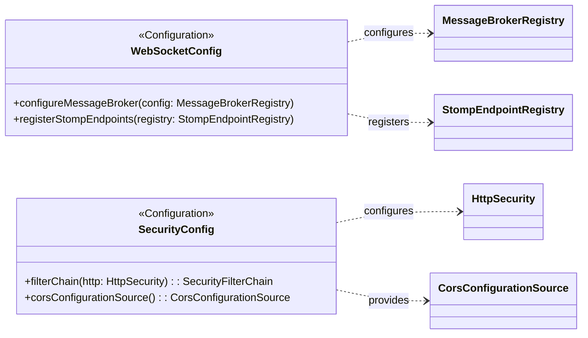

## Config & Security Class Diagram

 

## WebSocketConfig 클래스 정보

| 구분 | Name | Type | Visibility | Description |
|---|---|---|---|---|
| **class** | **WebSocketConfig** | | | 실시간 데이터 전송을 위한 STOMP 웹소켓 설정 클래스 |
| **Operations** | configureMessageBroker | void | public | `/topic` 접두사를 가진 브로커를 활성화하여 실시간 알림 경로 설정 |
| | registerStompEndpoints | void | public | `/ws-location` 엔드포인트를 등록하고 SockJS 및 CORS 허용 설정 |

 

## SecurityConfig 클래스 정보

| 구분 | Name | Type | Visibility | Description |
|---|---|---|---|---|
| **class** | **SecurityConfig** | | | 애플리케이션 보안 및 CORS 설정을 담당하는 클래스 |
| **Operations** | filterChain | SecurityFilterChain | public | HTTP 요청에 대한 보안 필터 설정 (현재 모든 `/api/**` 경로 허용) |
| | corsConfigurationSource | CorsConfigurationSource | public | 모든 Origin 및 Method(GET, POST 등)에 대한 CORS 허용 정책 정의 |
