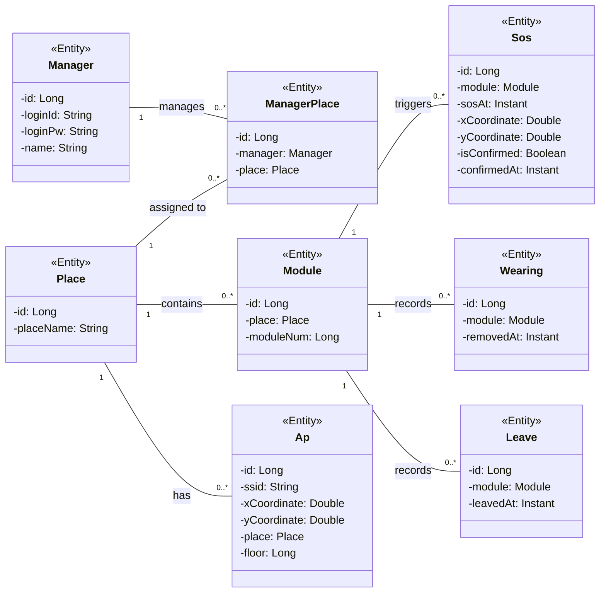

## Main Entity Relationship Diagram (ERD)

이 다이어그램은 시스템 전체에서 사용되는 주요 엔티티(Entity)들 간의 관계를 보여줍니다.

 

## Entity 정보

| 구분 | Name | Type | Visibility | Description |
|---|---|---|---|---|
| **class** | **Manager** | | | 시스템 관리자 엔티티 |
| **Attributes** | id | Long | private | 관리자 고유 ID (PK) |
| | loginId | String | private | 로그인 아이디 |
| | loginPw | String | private | 로그인 비밀번호 |
| | name | String | private | 관리자 이름 |

 

| 구분 | Name | Type | Visibility | Description |
|---|---|---|---|---|
| **class** | **Place** | | | 모듈 및 AP가 설치된 장소/구역 엔티티 |
| **Attributes** | id | Long | private | 장소 고유 ID (PK) |
| | placeName | String | private | 장소 이름 |

 

| 구분 | Name | Type | Visibility | Description |
|---|---|---|---|---|
| **class** | **ManagerPlace** | | | 관리자와 장소 간의 매핑 엔티티 |
| **Attributes** | id | Long | private | 매핑 고유 ID (PK) |
| | manager | Manager | private | 연결된 관리자 |
| | place | Place | private | 연결된 장소 |

 

| 구분 | Name | Type | Visibility | Description |
|---|---|---|---|---|
| **class** | **Module** | | | 사용자 단말기(모듈) 엔티티 |
| **Attributes** | id | Long | private | 모듈 고유 ID (PK) |
| | place | Place | private | 모듈이 소속된 장소 |
| | moduleNum | Long | private | 하드웨어 모듈 번호 |

 

| 구분 | Name | Type | Visibility | Description |
|---|---|---|---|---|
| **class** | **Ap** | | | 위치 측위를 위한 Access Point 엔티티 |
| **Attributes** | id | Long | private | AP 고유 ID (PK) |
| | ssid | String | private | AP의 SSID |
| | xCoordinate | Double | private | AP의 X 좌표 |
| | yCoordinate | Double | private | AP의 Y 좌표 |
| | place | Place | private | AP가 설치된 장소 |
| | floor | Long | private | 설치 층수 |

 

| 구분 | Name | Type | Visibility | Description |
|---|---|---|---|---|
| **class** | **Sos** | | | SOS 호출 이력 엔티티 |
| **Attributes** | id | Long | private | SOS 고유 ID (PK) |
| | module | Module | private | SOS를 호출한 모듈 |
| | sosAt | Instant | private | 호출 일시 |
| | xCoordinate | Double | private | 호출 당시 X 좌표 |
| | yCoordinate | Double | private | 호출 당시 Y 좌표 |
| | isConfirmed | Boolean | private | 관리자 확인 여부 |
| | confirmedAt | Instant | private | 관리자 확인 일시 |

 

| 구분 | Name | Type | Visibility | Description |
|---|---|---|---|---|
| **class** | **Wearing** | | | 미착용 감지 이력 엔티티 |
| **Attributes** | id | Long | private | 이력 고유 ID (PK) |
| | module | Module | private | 대상 모듈 |
| | removedAt | Instant | private | 미착용(탈거) 감지 일시 |

 

| 구분 | Name | Type | Visibility | Description |
|---|---|---|---|---|
| **class** | **Leave** | | | 구역 이탈 이력 엔티티 |
| **Attributes** | id | Long | private | 이력 고유 ID (PK) |
| | module | Module | private | 대상 모듈 |
| | leavedAt | Instant | private | 이탈 확정 일시 |
