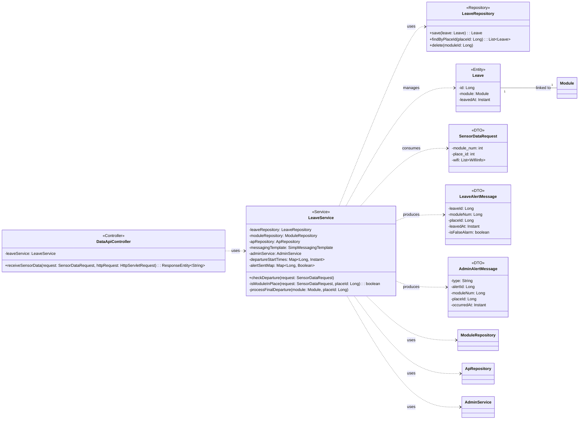

## Leave Class Diagram

 

## LeaveService 클래스 정보

| 구분 | Name | Type | Visibility | Description |
|---|---|---|---|---|
| **class** | **LeaveService** | | | 모듈의 지정 구역 이탈을 감지하고 알림을 처리하는 서비스 |
| **Attributes** | leaveRepository | LeaveRepository | private | 이탈 이력 저장을 위한 레포지토리 |
| | moduleRepository | ModuleRepository | private | 모듈 정보 조회를 위한 레포지토리 |
| | apRepository | ApRepository | private | 장소별 등록된 AP 목록 조회를 위한 레포지토리 |
| | messagingTemplate | SimpMessagingTemplate | private | WebSocket 알림 전송을 위한 템플릿 |
| | adminService | AdminService | private | 관리자 공통 알림 처리를 위한 서비스 |
| | departureStartTimes | Map~Long, Instant~ | private | 모듈별 최초 이탈 감지 시각 저장 (30초 지연 판단용) |
| | alertSentMap | Map~Long, Boolean~ | private | 중복 알림 방지를 위한 발송 여부 상태 관리 |
| **Operations** | checkDeparture | void | public | 센서 데이터를 분석하여 이탈 여부를 확인하고, 30초 이상 지속 시 이탈 확정 처리 |
| | isModuleInPlace | boolean | private | 스캔된 WiFi 목록 중 해당 장소의 AP가 포함되어 있는지 확인 |
| | processFinalDeparture | void | private | 이탈이 확정된 경우 DB에 기록하고 웹소켓 알림 전송 |

 

## LeaveRepository 클래스 정보

| 구분 | Name | Type | Visibility | Description |
|---|---|---|---|---|
| **class** | **LeaveRepository** | | | 이탈 이력 데이터 접근을 위한 인터페이스 |
| **Operations** | save | Leave | public | 이탈 이력 저장 |
| | findByPlaceId | List~Leave~ | public | 특정 장소의 이탈 이력 목록 조회 |
| | delete | void | public | 특정 모듈의 모든 이탈 로그 삭제 |

 

## Leave 엔티티 정보

| 구분 | Name | Type | Visibility | Description |
|---|---|---|---|---|
| **class** | **Leave** | | | 구역 이탈 정보를 담는 엔티티 |
| **Attributes** | id | Long | private | 이탈 이력 고유 ID (PK) |
| | module | Module | private | 이탈이 발생한 모듈 엔티티 |
| | leavedAt | Instant | private | 이탈이 확정된 일시 |

 

## SensorDataRequest 클래스 정보 (DTO)

| 구분 | Name | Type | Visibility | Description |
|---|---|---|---|---|
| **class** | **SensorDataRequest** | | | ESP32 모듈로부터 수신되는 센서 데이터 DTO |
| **Attributes** | module_num | int | private | 하드웨어 모듈 번호 |
| | place_id | int | private | 설치 장소 ID |
| | btn | int | private | 버튼 상태 |
| | btn_press_3s | int | private | SOS 버튼 트리거 상태 |
| | light | float | private | 조도 값 |
| | touch | int | private | 터치 센서 값 |
| | reset | int | private | 리셋 상태 |
| | wifi | List~WifiInfo~ | private | 스캔된 주변 WiFi 정보 목록 |

 

## LeaveAlertMessage 클래스 정보 (DTO)

| 구분 | Name | Type | Visibility | Description |
|---|---|---|---|---|
| **class** | **LeaveAlertMessage** | | | 이탈 발생 시 전송되는 알림 메시지 DTO |
| **Attributes** | leaveId | Long | private | 생성된 이탈 이력 ID |
| | moduleNum | Long | private | 모듈 번호 |
| | placeId | Long | private | 장소 ID |
| | leavedAt | Instant | private | 이탈 시각 |
| | inPlace | boolean | private | 구역 내 존재 여부 (true 시 정상) |
