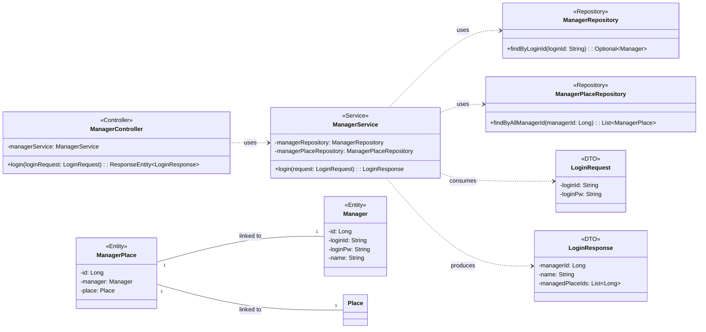

## Manager Class Diagram

 

## ManagerService 클래스 정보

| 구분 | Name | Type | Visibility | Description |
|---|---|---|---|---|
| **class** | **ManagerService** | | | 관리자 인증 및 권한 확인을 담당하는 서비스 |
| **Attributes** | managerRepository | ManagerRepository | private | 관리자 정보 조회를 위한 레포지토리 |
| | managerPlaceRepository | ManagerPlaceRepository | private | 관리자별 할당된 장소 조회를 위한 레포지토리 |
| **Operations** | login | LoginResponse | public | 아이디/비밀번호 확인 후 관리자 정보 및 담당 장소 목록 반환 |

 

## ManagerRepository 클래스 정보

| 구분 | Name | Type | Visibility | Description |
|---|---|---|---|---|
| **class** | **ManagerRepository** | | | 관리자 데이터 접근을 위한 인터페이스 |
| **Operations** | findByLoginId | Optional~Manager~ | public | 로그인 아이디로 관리자 정보 조회 |

 

## ManagerPlaceRepository 클래스 정보

| 구분 | Name | Type | Visibility | Description |
|---|---|---|---|---|
| **class** | **ManagerPlaceRepository** | | | 관리자-장소 매핑 데이터 접근을 위한 인터페이스 |
| **Operations** | findByAllManagerId | List~ManagerPlace~ | public | 특정 관리자가 담당하는 모든 장소 매핑 정보 조회 |

 

## LoginRequest 클래스 정보 (DTO)

| 구분 | Name | Type | Visibility | Description |
|---|---|---|---|---|
| **class** | **LoginRequest** | | | 관리자 로그인 요청 DTO |
| **Attributes** | loginId | String | private | 관리자 아이디 |
| | loginPw | String | private | 관리자 비밀번호 |

 

## LoginResponse 클래스 정보 (DTO)

| 구분 | Name | Type | Visibility | Description |
|---|---|---|---|---|
| **class** | **LoginResponse** | | | 관리자 로그인 응답 DTO |
| **Attributes** | managerId | Long | private | 관리자 고유 ID |
| | name | String | private | 관리자 이름 |
| | managedPlaceIds | List~Long~ | private | 관리 권한이 있는 장소 ID 목록 |
