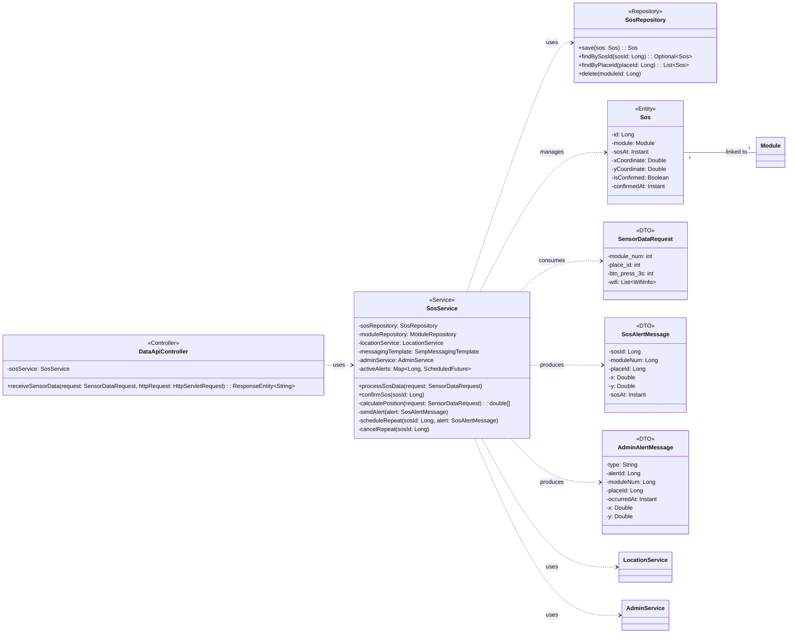

## SOS Class Diagram

 

## DataApiController 클래스 정보

| 구분 | Name | Type | Visibility | Description |
|---|---|---|---|---|
| **class** | **DataApiController** | | | ESP32 모듈로부터 수신되는 각종 센서 데이터를 처리하는 컨트롤러 |
| **Attributes** | sosService | SosService | private | SOS 호출 관련 비즈니스 로직 처리 서비스 |
| **Operations** | receiveSensorData | ResponseEntity~String~ | public | 모듈 데이터 수신 및 각 기능(SOS, 이탈, 착용 등) 서비스 호출 |

 

## SosService 클래스 정보

| 구분 | Name | Type | Visibility | Description |
|---|---|---|---|---|
| **class** | **SosService** | | | SOS 호출 감지 및 알림 처리를 담당하는 서비스 |
| **Attributes** | sosRepository | SosRepository | private | SOS 데이터 저장을 위한 레포지토리 |
| | moduleRepository | ModuleRepository | private | 모듈 정보 조회를 위한 레포지토리 |
| | locationService | LocationService | private | SOS 발생 위치 계산을 위한 서비스 |
| | messagingTemplate | SimpMessagingTemplate | private | WebSocket 알림 전송을 위한 템플릿 |
| | adminService | AdminService | private | 관리자 공통 알림 처리를 위한 서비스 |
| | activeAlerts | Map~Long, ScheduledFuture~ | private | 활성화된 SOS 알림 스케줄링 관리 |
| **Operations** | processSosData | void | public | 센서 데이터를 분석하여 SOS 발생 시 DB 저장 및 알림 트리거 |
| | confirmSos | void | public | 관리자가 SOS 상황을 확인했을 때 상태 업데이트 및 알림 중단 |
| | calculatePosition | double[] | private | WiFi RSSI 데이터를 기반으로 SOS 좌표 계산 |
| | sendAlert | void | private | 특정 모듈 채널로 SOS 알림 전송 |
| | scheduleRepeat | void | private | SOS 미확인 시 주기적인 재알림 스케줄링 |
| | cancelRepeat | void | private | SOS 확인 시 예약된 알림 취소 |

 

## SosRepository 클래스 정보

| 구분 | Name | Type | Visibility | Description |
|---|---|---|---|---|
| **class** | **SosRepository** | | | SOS 이력 데이터 접근을 위한 인터페이스 |
| **Operations** | save | Sos | public | SOS 엔티티 저장 |
| | findBySosId | Optional~Sos~ | public | ID로 SOS 정보 조회 |
| | findByPlaceId | List~Sos~ | public | 특정 장소의 SOS 이력 목록 조회 |
| | delete | void | public | 특정 모듈의 모든 SOS 로그 삭제 |

 

## Sos 엔티티 정보

| 구분 | Name | Type | Visibility | Description |
|---|---|---|---|---|
| **class** | **Sos** | | | SOS 호출 정보를 담는 엔티티 |
| **Attributes** | id | Long | private | SOS 고유 ID (PK) |
| | module | Module | private | 호출이 발생한 모듈 엔티티 |
| | sosAt | Instant | private | 호출 일시 |
| | xCoordinate | Double | private | 호출 발생 X 좌표 |
| | yCoordinate | Double | private | 호출 발생 Y 좌표 |
| | isConfirmed | Boolean | private | 관리자 확인 여부 |
| | confirmedAt | Instant | private | 관리자 확인 일시 |

 

## SensorDataRequest 클래스 정보 (DTO)

| 구분 | Name | Type | Visibility | Description |
|---|---|---|---|---|
| **class** | **SensorDataRequest** | | | ESP32 모듈로부터 수신되는 센서 데이터 DTO |
| **Attributes** | module_num | int | private | 하드웨어 모듈 번호 |
| | place_id | int | private | 설치 장소 ID |
| | btn | int | private | 일반 버튼 상태 |
| | btn_press_3s | int | private | SOS 버튼 3초 눌림 상태 (1: 발생) |
| | light | float | private | 조도 센서 값 |
| | touch | int | private | 터치 센서 값 |
| | reset | int | private | 리셋 버튼 상태 |
| | wifi | List~WifiInfo~ | private | 측위를 위한 WiFi 스캔 목록 |

 

## SosAlertMessage 클래스 정보 (DTO)

| 구분 | Name | Type | Visibility | Description |
|---|---|---|---|---|
| **class** | **SosAlertMessage** | | | SOS 발생 시 클라이언트로 전송되는 알림 DTO |
| **Attributes** | sosId | Long | private | 생성된 SOS 이력 ID |
| | moduleNum | Long | private | 모듈 번호 |
| | placeId | Long | private | 장소 ID |
| | xCordinate | Double | private | 발생 X 좌표 (코드상 오타 xCordinate 유지) |
| | yCordinate | Double | private | 발생 Y 좌표 (코드상 오타 yCordinate 유지) |
| | sosAt | Instant | private | 발생 시각 |

 

## AdminAlertMessage 클래스 정보 (DTO)

| 구분 | Name | Type | Visibility | Description |
|---|---|---|---|---|
| **class** | **AdminAlertMessage** | | | 통합 관리자 화면용 실시간 알림 DTO |
| **Attributes** | type | String | private | 알림 타입 (SOS, LEAVE, WEARING 등) |
| | alertId | Long | private | 알림 고유 ID |
| | moduleNum | Long | private | 모듈 번호 |
| | placeId | Long | private | 장소 ID |
| | occurredAt | Instant | private | 발생 시각 |
| | xCoordinate | Double | private | 발생 X 좌표 (실제 필드명) |
| | yCoordinate | Double | private | 발생 Y 좌표 (실제 필드명) |
