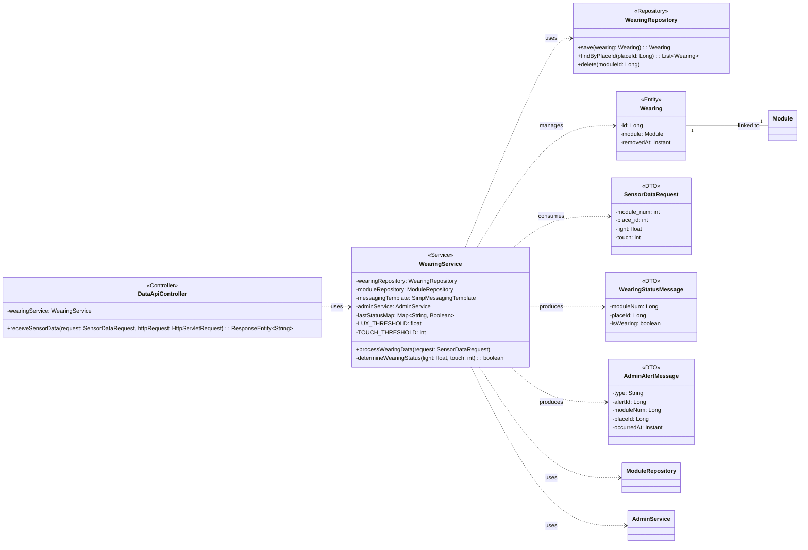

## Wearing Class Diagram

 

## WearingService 클래스 정보

| 구분 | Name | Type | Visibility | Description |
|---|---|---|---|---|
| **class** | **WearingService** | | | 모듈의 착용 상태를 감지하고 미착용(탈거) 시 알림을 처리하는 서비스 |
| **Attributes** | wearingRepository | WearingRepository | private | 미착용 이력 저장을 위한 레포지토리 |
| | moduleRepository | ModuleRepository | private | 모듈 정보 조회를 위한 레포지토리 |
| | messagingTemplate | SimpMessagingTemplate | private | WebSocket 알림 전송을 위한 템플릿 |
| | adminService | AdminService | private | 관리자 공통 알림 처리를 위한 서비스 |
| | lastStatusMap | Map~String, Boolean~ | private | 모듈별 직전 착용 상태 저장 (상태 변경 감지용) |
| | LUX_THRESHOLD | float | private | 조도 임계값 (50 lx 이하 시 착용으로 간주) |
| | TOUCH_THRESHOLD | int | private | 터치 센서 임계값 (2000 이상 시 착용으로 간주) |
| **Operations** | processWearingData | void | public | 센서 데이터를 분석하여 착용 상태를 판별하고, 착용 중 -> 미착용 변경 시 DB 기록 및 알림 전송 |
| | determineWearingStatus | boolean | private | 조도 및 터치 값을 기준으로 현재 착용 상태 여부 판별 |

 

## WearingRepository 클래스 정보

| 구분 | Name | Type | Visibility | Description |
|---|---|---|---|---|
| **class** | **WearingRepository** | | | 미착용 이력 데이터 접근을 위한 인터페이스 |
| **Operations** | save | Wearing | public | 미착용 이력 저장 |
| | findByPlaceId | List~Wearing~ | public | 특정 장소의 미착용 이력 목록 조회 |
| | delete | void | public | 특정 모듈의 모든 미착용 로그 삭제 |

 

## Wearing 엔티티 정보

| 구분 | Name | Type | Visibility | Description |
|---|---|---|---|---|
| **class** | **Wearing** | | | 미착용(탈거) 감지 정보를 담는 엔티티 |
| **Attributes** | id | Long | private | 이력 고유 ID (PK) |
| | module | Module | private | 미착용이 발생한 모듈 엔티티 |
| | removedAt | Instant | private | 미착용(탈거)이 감지된 일시 |

 

## SensorDataRequest 클래스 정보 (DTO)

| 구분 | Name | Type | Visibility | Description |
|---|---|---|---|---|
| **class** | **SensorDataRequest** | | | ESP32 모듈로부터 수신되는 센서 데이터 DTO |
| **Attributes** | module_num | int | private | 하드웨어 모듈 번호 |
| | place_id | int | private | 설치 장소 ID |
| | btn | int | private | 버튼 상태 |
| | btn_press_3s | int | private | SOS 버튼 트리거 상태 |
| | light | float | private | 조도 값 |
| | touch | int | private | 터치 센서 값 |
| | reset | int | private | 리셋 상태 |
| | wifi | List~WifiInfo~ | private | 스캔된 주변 WiFi 정보 목록 |

 

## WearingStatusMessage 클래스 정보 (DTO)

| 구분 | Name | Type | Visibility | Description |
|---|---|---|---|---|
| **class** | **WearingStatusMessage** | | | 현재 착용 상태를 전송하는 메시지 DTO |
| **Attributes** | moduleNum | Long | private | 모듈 번호 |
| | placeId | Long | private | 장소 ID |
| | isWearing | boolean | private | 현재 착용 여부 |

 

## AdminAlertMessage 클래스 정보 (DTO)

| 구분 | Name | Type | Visibility | Description |
|---|---|---|---|---|
| **class** | **AdminAlertMessage** | | | 미착용(WEARING) 알림용 실시간 메시지 DTO |
| **Attributes** | type | String | private | 알림 타입 ("WEARING") |
| | alertId | Long | private | 생성된 미착용 이력 ID |
| | moduleNum | Long | private | 모듈 번호 |
| | placeId | Long | private | 장소 ID |
| | occurredAt | Instant | private | 발생 시각 |
