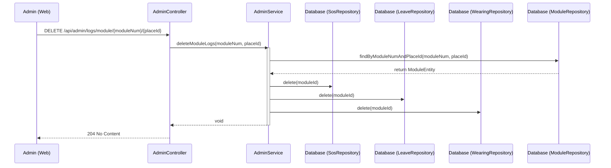

## Module Log Delete Sequence Diagram

 

## 모듈 로그 삭제 (deleteModuleLogs)

| 항목 | 흐름 요약 | 핵심 비즈니스 로직 |
|:---|:---|:---|
| **목표** | 특정 모듈의 모든 발생 이벤트 로그 일괄 삭제 | - |
| **모듈 확인** | 입력된 `moduleNum`과 `placeId`로 실제 등록된 모듈인지 확인합니다. | `moduleRepository.findByModuleNumAndPlaceId` |
| **SOS 로그 삭제** | 해당 모듈과 연관된 모든 SOS 기록을 삭제합니다. | `sosRepository.delete(moduleId)` |
| **이탈 로그 삭제** | 해당 모듈과 연관된 모든 이탈 기록을 삭제합니다. | `leaveRepository.delete(moduleId)` |
| **미착용 로그 삭제** | 해당 모듈과 연관된 모든 미착용 기록을 삭제합니다. | `wearingRepository.delete(moduleId)` |
| **결과 반환** | 성공 시 별도의 데이터 없이 204 No Content 응답을 반환합니다. | - |
