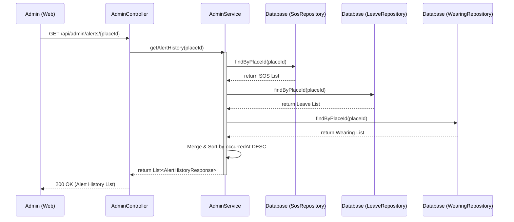

## Alert History Sequence Diagram

 

## 알림 이력 조회 (getAlertHistory)

| 항목 | 흐름 요약 | 핵심 비즈니스 로직 |
|:---|:---|:---|
| **목표** | 특정 장소의 모든 과거 알림 이력을 통합 조회 | - |
| **유형별 조회** | SOS, 이탈, 미착용 레포지토리에서 각각 이력을 조회합니다. | `findByPlaceId` (sos, leave, wearing) |
| **DTO 변환** | 각 도메인 엔티티를 공통 형식인 `AlertHistoryResponse`로 변환합니다. | - |
| **데이터 통합** | 조회된 모든 리스트를 하나의 리스트로 병합합니다. | `new ArrayList<>()` 후 `addAll` |
| **정렬** | 발생 시각(`occurredAt`)을 기준으로 최신순 정렬합니다. | `result.sort((a, b) -> b.getOccurredAt().compareTo(a.getOccurredAt()))` |
| **결과 반환** | 최종 정렬된 통합 리스트를 반환합니다. | - |
