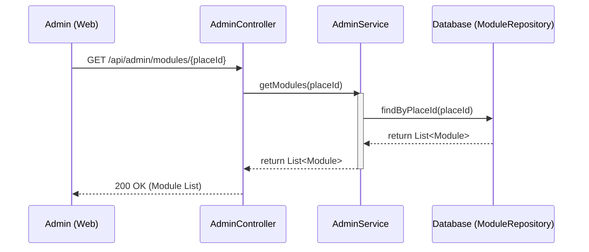

## Get Modules Sequence Diagram

 

## 모듈 목록 조회 (getModules)

| 항목 | 흐름 요약 | 핵심 비즈니스 로직 |
|:---|:---|:---|
| **목표** | 특정 장소에 등록된 모든 모듈 정보 조회 | - |
| **데이터 조회** | `placeId`를 기반으로 해당 구역에 소속된 모든 모듈 엔티티를 조회합니다. | `moduleRepository.findByPlaceId(placeId)` |
| **결과 반환** | 조회된 모듈 리스트를 JSON 형태로 반환합니다. | `@JsonIgnore`를 통해 순환 참조 방지 (Module 엔티티 설정) |
