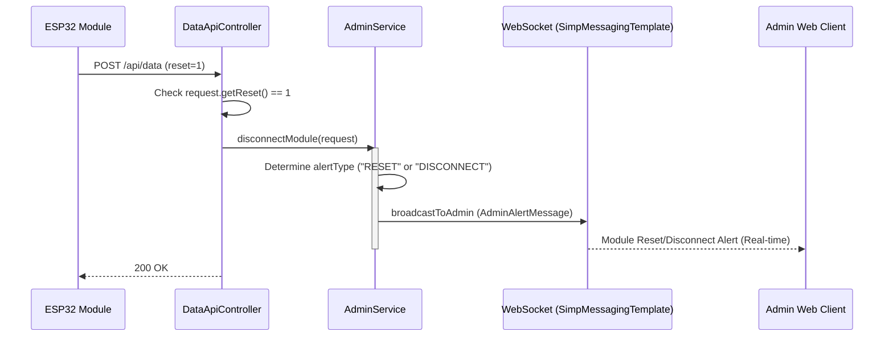

## Module Reset Sequence Diagram

 

## 모듈 연결 상태 처리 (disconnectModule)

| 항목 | 흐름 요약 | 핵심 비즈니스 로직 |
|:---|:---|:---|
| **목표** | 모듈의 물리적 리셋 또는 연결 종료 상태를 감지하여 관리자에게 알림 | - |
| **리셋 감지** | ESP32로부터 `reset=1` 상태가 포함된 데이터를 수신하면 로직을 시작합니다. | `request.getReset() == 1` 확인 |
| **알림 타입 결정** | `reset` 필드 값에 따라 "RESET" 또는 "DISCONNECT" 타입을 결정합니다. | 현재 코드상 `reset == 1`이면 "RESET", 그 외 "DISCONNECT" (조건부) |
| **메시지 구성** | 발생한 모듈 번호, 장소 ID, 발생 시각을 포함한 `AdminAlertMessage`를 생성합니다. | `new AdminAlertMessage(...)` |
| **실시간 브로드캐스트** | WebSocket을 통해 관리자 화면의 특정 장소 토픽으로 알림을 전송합니다. | `messagingTemplate.convertAndSend("/topic/admin/{placeId}", ...)` |
| **로그 기록** | 서버 로그를 통해 어떤 모듈에서 리셋이 발생했는지 기록합니다. | `log.info("[Admin] 모듈 ... RESET 요청")` |
