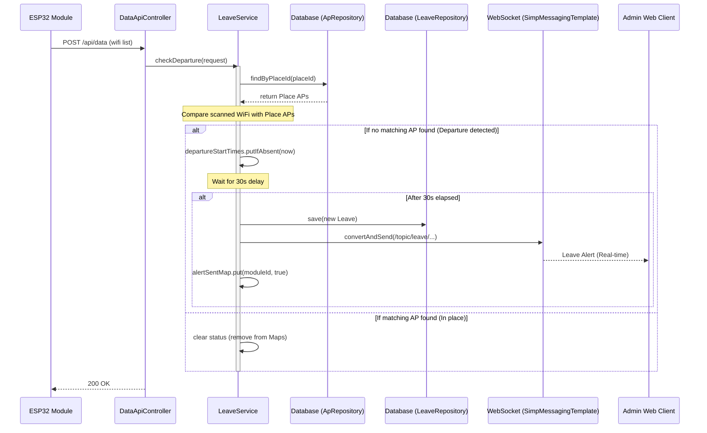

## Leave Process Sequence Diagram

 

## 이탈 감지 (checkDeparture)

| 항목 | 흐름 요약 | 핵심 비즈니스 로직 |
|:---|:---|:---|
| **목표** | 모듈의 지정 구역 이탈 여부 판단 및 알림 | - |
| **WiFi 스캔 수신** | ESP32로부터 주변 WiFi 정보를 포함한 `SensorDataRequest`를 수신합니다. | - |
| **구역 확인** | `ApRepository`를 통해 해당 장소의 AP 목록을 조회하고, 수신된 데이터와 대조합니다. | `isModuleInPlace`: 등록된 AP 중 하나라도 감지되면 정상 상태로 판단 |
| **이탈 감지 시** | 장소 AP가 감지되지 않으면 `departureStartTimes`에 현재 시각을 기록합니다. | 지연 판단을 위한 상태 관리 (`ConcurrentHashMap`) |
| **지연 판단 (30초)** | 첫 감지 시점으로부터 30초가 경과했는지 확인합니다. | `LEAVE_DELAY_SECONDS = 30`: 일시적 신호 손실로 인한 오탐 방지 |
| **이탈 확정 및 저장** | 30초 지속 시 `Leave` 엔티티를 생성하여 DB에 저장합니다. | `leaveRepository.save`: 이력 보존 |
| **알림 전송** | 관리자 웹(WebSocket) 및 브로드캐스트 채널로 이탈 알림을 전송합니다. | `messagingTemplate.convertAndSend`, `adminService.broadcastToAdmin` |
| **상태 초기화** | 구역 내 AP가 다시 감지되면 이탈 관련 기록을 맵에서 제거합니다. | 비정상 종료 및 재진입 처리 |
