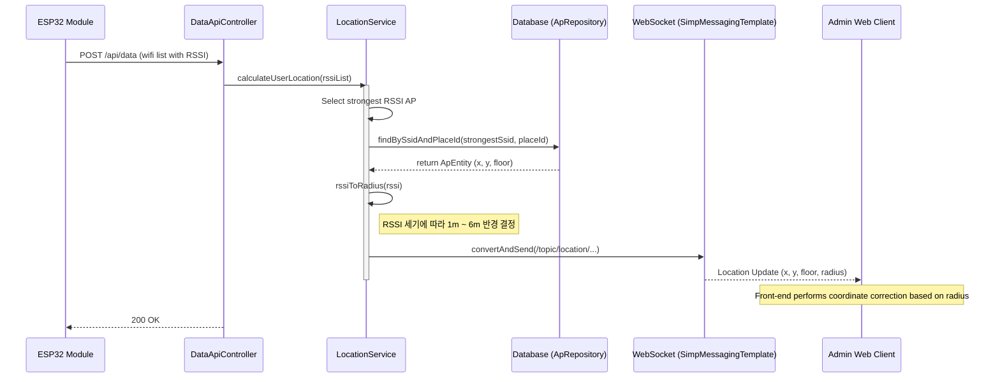

## Location Update Sequence Diagram

 

## 위치 측위 업데이트 (calculateUserLocation)

| 항목 | 흐름 요약 | 핵심 비즈니스 로직 |
|:---|:---|:---|
| **목표** | 가장 신호가 강한 AP 정보를 기반으로 사용자 위치 데이터 전송 | - |
| **위치 계산** | `LocationService`를 통해 수신된 WiFi RSSI 중 가장 신호가 강한 AP를 기준으로 데이터를 구성합니다. | `calculateUserLocation`: 가장 신호가 강한 AP 기준 |
| **기준 AP 선택** | 수신된 목록 중 신호가 가장 강한(Maximum RSSI) AP를 선택합니다. | `max((a, b) -> Double.compare(a.getRssi(), b.getRssi()))` |
| **좌표 조회** | 선택된 AP의 정보를 DB에서 조회하여 해당 AP의 고정 설치 좌표(X, Y)를 가져옵니다. | `apRepository.findBySsidAndPlaceId` |
| **오차 범위 계산** | RSSI 신호 강도에 따라 위치의 정확도(반경)를 1m에서 6m 사이로 결정합니다. | `rssiToRadius`: 프론트엔드 보정의 기초 데이터로 활용 |
| **위치 정보 전송** | 가장 센 AP의 좌표와 반경 정보를 전송합니다. 실제 시각적 보정은 프론트엔드에서 수행합니다. | `messagingTemplate.convertAndSend`: `/topic/location/...` |
| **프론트엔드 보정** | 수신된 AP 좌표와 반경(RSSI 기반) 정보를 바탕으로 프론트엔드 UI에서 위치 보정을 수행합니다. | **프론트엔드 자체 좌표 보정 로직 적용** |
