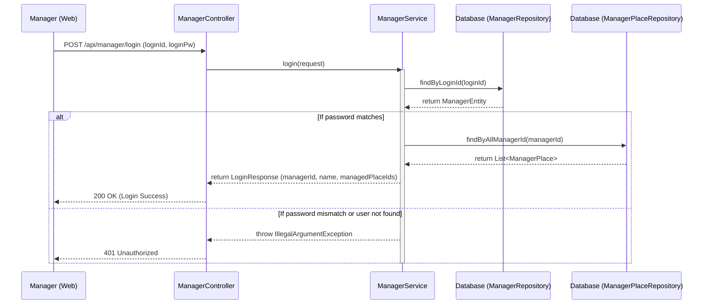

## Manager Login Sequence Diagram

 

## 관리자 로그인 (login)

| 항목 | 흐름 요약 | 핵심 비즈니스 로직 |
|:---|:---|:---|
| **목표** | 관리자 계정 인증 및 담당 구역 정보 반환 | - |
| **계정 조회** | 입력된 `loginId`를 기반으로 `Manager` 엔티티를 조회합니다. | `managerRepository.findByLoginId` |
| **비밀번호 검증** | 데이터베이스의 암호와 입력된 암호가 일치하는지 대조합니다. | - |
| **권한 조회** | 인증 성공 시 해당 관리자가 담당하는 장소 목록(`ManagerPlace`)을 조회합니다. | `managerPlaceRepository.findByAllManagerId` |
| **응답 생성** | 관리자 정보와 장소 ID 목록을 포함한 `LoginResponse`를 생성합니다. | `LoginResponse.builder` |
| **예외 처리** | 계정이 없거나 비밀번호가 틀린 경우 인증 실패 에러를 반환합니다. | `IllegalArgumentException` (401 Unauthorized) |
