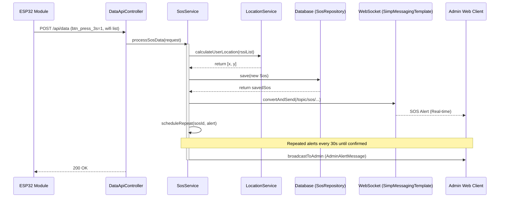

## SOS Process Sequence Diagram

 

## SOS 처리 (processSosData)

| 항목 | 흐름 요약 | 핵심 비즈니스 로직 |
|:---|:---|:---|
| **목표** | 긴급 호출 발생 시 위치 파악 및 관리자 전파 | - |
| **SOS 감지** | `btn_press_3s=1` 상태가 포함된 데이터를 수신하면 SOS 로직을 시작합니다. | - |
| **위치 계산** | `LocationService`를 통해 수신된 WiFi RSSI 기반의 현재 좌표를 산출합니다. | `calculatePosition`: WiFi 목록이 3개 미만이면 좌표 생략 |
| **데이터 저장** | 발생 시각 및 좌표 정보를 포함하여 `Sos` 이력을 DB에 저장합니다. | `sosRepository.save` |
| **실시간 알림** | WebSocket을 통해 해당 모듈 전용 채널로 즉시 알림을 전송합니다. | `sendAlert` |
| **반복 알림 예약** | 관리자가 확인할 때까지 30초 간격으로 알림을 반복 전송하도록 설정합니다. | `scheduleRepeat`: `ScheduledExecutorService` 사용 |
| **관리자 전파** | 통합 관리자 화면으로 SOS 발생 메시지를 브로드캐스트합니다. | `adminService.broadcastToAdmin` |
| **확인 처리** | 관리자가 SOS를 확인(`confirmSos`)하면 반복 알림을 취소합니다. | `cancelRepeat`: `ScheduledFuture.cancel` |
