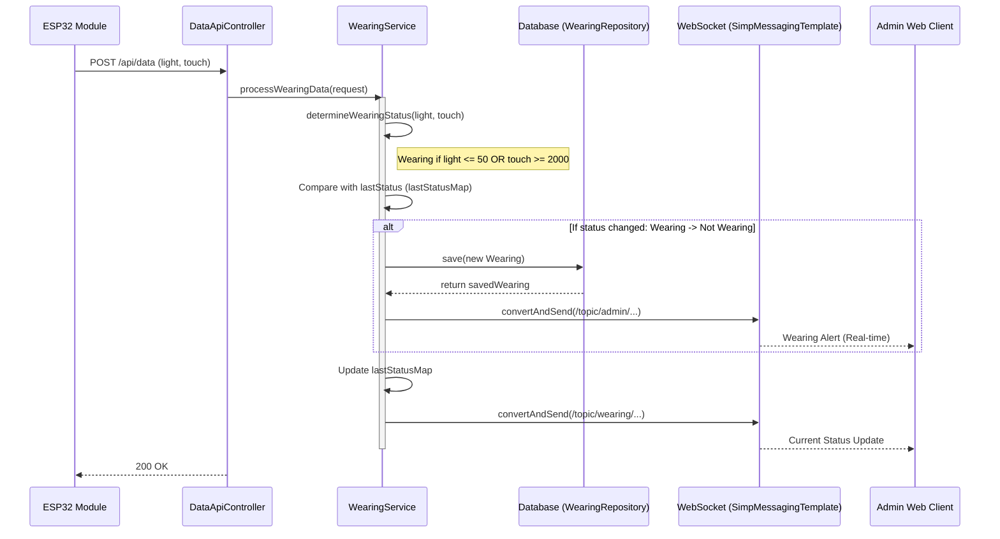

## Wearing Process Sequence Diagram

 

## 착용 상태 처리 (processWearingData)

| 항목 | 흐름 요약 | 핵심 비즈니스 로직 |
|:---|:---|:---|
| **목표** | 센서 기반 착용 여부 판별 및 미착용 시 알림 | - |
| **데이터 수신** | ESP32로부터 조도(`light`)와 터치(`touch`) 센서 값을 수신합니다. | - |
| **상태 판별** | 센서 임계값을 기준으로 현재 착용 상태를 결정합니다. | `light <= 50` 또는 `touch >= 2000`이면 착용으로 간주 |
| **상태 변경 확인** | 메모리(`lastStatusMap`)에 저장된 이전 상태와 비교합니다. | - |
| **미착용 감지** | '착용 중'에서 '미착용'으로 변경된 경우 이력을 기록합니다. | `wearingRepository.save`: 탈거 시점 저장 |
| **관리자 알림** | 미착용 발생 사실을 통합 관리자 화면으로 브로드캐스트합니다. | `adminService.broadcastToAdmin` |
| **실시간 상태 업데이트** | 현재 착용 여부를 해당 모듈 채널로 즉시 전송합니다. | `messagingTemplate.convertAndSend`: 실시간 모니터링용 |
